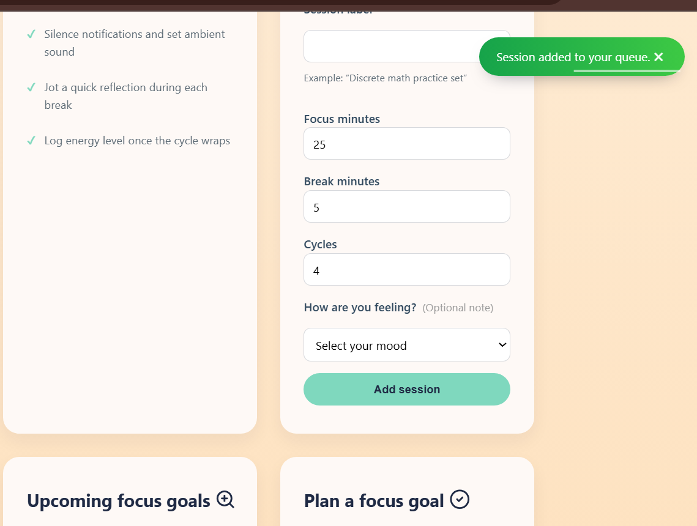
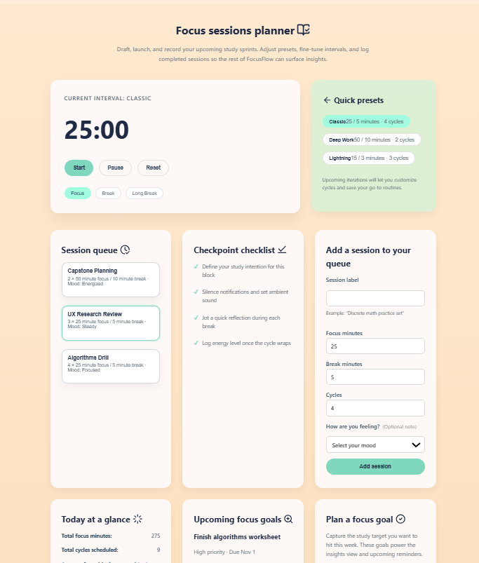
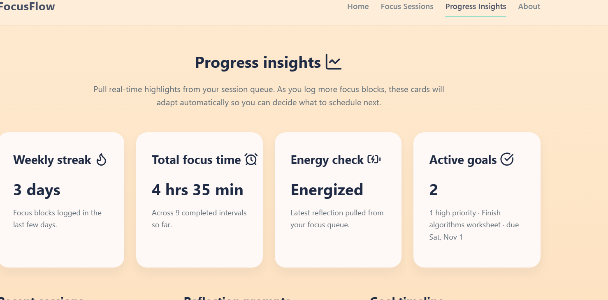

# FocusFlow Study Timer App

FocusFlow is our CS346 semester project for building a study timer web application with Node.js, Express, EJS, and PostgreSQL.

## Features

- 🚀 **Node.js 20** + **Express 4** - Modern JavaScript backend
- 🎨 **EJS** - Server-side templating
- 🗄️ **PostgreSQL** - Reliable relational database
- 🔒 **Security First** - Helmet, CSRF protection, secure sessions
- 📝 **Clean Code** - ESLint, Prettier, best practices
- 🎓 **Educational** - Well-documented, instructional code

## Technical Architecture

- **Routes** (`src/routes`) map URLs to controllers.
- **Controllers** (`src/controllers`) validate input, call models/services, log outcomes, and render EJS or JSON responses.
- **Models/Stores** (`src/models`) wrap Supabase/Postgres calls, normalize rows, and propagate structured errors.
- **Views** (`src/views`) are EJS templates that consume controller-provided data.

Request flow example: `POST /focus/sessions` → `indexController.createSession` → `sessionStore.addSession` → log outcome → render redirect/JSON. Shared middleware in `app.js` adds CSRF tokens, flash messages, nav data, and user context for every view.

## Quick Start

1. **Clone the repository**

   ```bash
   git clone https://github.com/UWO-CS346-Fall-25/cs346f25-study-timer-pomodoro-app.git
   cd cs346f25-study-timer-pomodoro-app
   ```

2. **Install dependencies**

   ```bash
   npm install
   ```

3. **Set up environment variables**

   ```bash
   cp .env.example .env
   # Add Supabase URL, anon key, service role key, and session secrets
   ```

   The `.env` file now includes optional auth helpers such as `SESSION_COOKIE_NAME` and `BCRYPT_SALT_ROUNDS`;

4. **Create Supabase tables**

   - Open the Supabase SQL editor and run [`db/migrations/002_create_focus_tables.sql`](db/migrations/002_create_focus_tables.sql)
     to provision the `focus_sessions` and `focus_goals` tables.
   - Run [`db/migrations/003_create_focus_users_table.sql`](db/migrations/003_create_focus_users_table.sql)
     to create the `focus_users` table that stores hashed credentials.
   - Run [`db/migrations/004_add_user_id_to_focus_tables.sql`](db/migrations/004_add_user_id_to_focus_tables.sql)
     to attach sessions/goals to a specific `focus_users.id`.
   - Run [`db/migrations/005_add_auth_columns_to_focus_users.sql`](db/migrations/005_add_auth_columns_to_focus_users.sql)
     to add Supabase Auth metadata (`auth_user_id`, `email_verified_at`) to `focus_users`.
   - (Optional) keep `db/migrations/001`/`seed.js` for local Postgres development.

5. **Start the application**

   ```bash
   npm run dev
   ```

6. **Open your browser**
   ```
   http://localhost:3000
   ```

## Current Pages (Deliverable 1)

The Week 7 HTML/CSS deliverable focuses on the static structure of the FocusFlow study timer. The Express app now serves four EJS pages with shared navigation and footer:

- Home (``) – High-level overview of FocusFlow with hero messaging, feature highlights, and workflow steps.
- Focus Sessions (`/focus`) – Static mock of the timer controls, preset selector, and session queue layout.
- Progress Insights (`/insights`) – Dashboard-style placeholders showing weekly metrics, recent sessions, and reflection prompts.
- About (`/about`) – Team introduction plus the goals for this deliverable.

All pages share the new FocusFlow color palette and component styles, including background colors and interactive button states defined in `src/public/css/style.css`. Content remains static by design; JavaScript logic and data integration will arrive later.

## Current Pages (Deliverable 2)

Week 8 focuses on the interactive Focus Sessions flow and basic server logic.

- **Ab (server & data)**
  - Hold session data in memory (seed JSON for defaults) and pass it to EJS.
  - Handle POST `/focus/sessions`, validate input, and set flash messages.
  - Return a JSON API (`/api/sessions`) that client JS can call.
  - Write the client logic to validate the form and refresh the queue live.
- **Dasha (client experience)**
  - Wire preset buttons and form validation on the Focus page.
  - Keep the current-interval hero, session queue, and summary in sync.
  - Show inline success/error states with keyboard-friendly controls.
  - Polish styling/animations so interactions feel smooth.

## Current Pages (Deliverable 3)

Week 9 focuses on front-end polish, form design, and usability improvements.

## What we already cover
- Focus session form already meets the 3+ input types + validation requirement (`src/views/focus.ejs`, `src/public/js/main.js`, `POST /focus/sessions`).
- Routes/controllers already capture submissions and return JSON (`src/controllers/indexController.js`).
- Base UI has gradients, active states, and responsive grids from Deliverable 2 (`src/public/css/style.css`).

## Split
**Ab**
- Keep `feature/week9-ui-enhancements` in sync with `main`
- Build the goal endpoints (`POST /focus/goals`, `/api/goals`) plus the supporting model `src/models/goalStore.js`; continue to expose any extra data modifications Dasha needs.
- Wire any additional template placeholders or partials needed for the UI polish (e.g., hero copy, modals) and keep MVC tidy.
- Refresh README once Dasha finishes visuals and drop the proof assets into `docs/` before the PR.

**Dasha**
- Does the front-end polish: integrate the selected UI improvements (animations, spacing, responsive adjustments) in `src/public/css/style.css` and `src/public/js/main.js`.
- Pull in Lucide icons and Toastify (or the final two choices) and apply them to the focus/insights pages.
- Capture the Week 9 screenshots or a short clip for the PR + README.

## New Improvements description and screenshots
- Added 3 input types in session queue form (input, number, and drop down menu)
- Integrated CSS background, header, and footer transitions and animations when quick presets buttons are clicked
- Updated button clicks by adding a transition to show when a button is pressed
- Added Toastify notifications to improve the notification visuals
- Added Lucide Icons to create a visually appealing website





## Current Pages (Deliverable 4)

Week 10 introduces Supabase-backed persistence so the Focus page forms now read/write real data.

- **Supabase integration** – `src/lib/supabaseClient.js` bootstraps the service role client using the new `.env` values. The `focus_sessions` and `focus_goals` tables are created in supabase.
- **Repositories** – The in-memory stores were replaced with Supabase repositories (`src/models/sessionStore.js`, `src/models/goalStore.js`). Controllers now `await` the DB results and build summaries/snapshots from live rows.
- **Forms and APIs** – `/focus/sessions` and `/focus/goals` POST endpoints persist data to Supabase; `/api/sessions` and `/api/goals` stream JSON for the AJAX refresh. Toastify toasts and empty-state messaging now reflect DB current state and results.

## Current Pages (Deliverable 5)

Week 11 brings full authentication and session workflows.

- **Supabase-backed users** – [`db/migrations/003_create_focus_users_table.sql`](db/migrations/003_create_focus_users_table.sql) provisions the `focus_users` table with citext uniqueness on username/email plus `last_login_at` tracking. [`src/models/userStore.js`](src/models/userStore.js) wraps the table with helpers to create users, fetch by email/username/id, and stamp login timestamps.
- **Secure registration & login** – [`src/controllers/userController.js`](src/controllers/userController.js) validates inputs, hashes passwords with bcrypt (configurable rounds), and returns structured errors for HTML or JSON.
- **Session middleware** – [`src/middleware/auth.js`](src/middleware/auth.js) guards protected routes, remembers the intended destination for redirects, and emits JSON errors for API requests. Express-session now uses a named cookie plus SameSite/secure defaults.
- **Protected experience** – `/focus`, `/insights`, and related APIs are locked behind authentication. Header UI reflects login status with a friendly greeting + logout form, while `/auth/register` and `/auth/login` provide starter EJS views that Dasha can enhance.
- **Per-user data** – [`db/migrations/004_add_user_id_to_focus_tables.sql`](db/migrations/004_add_user_id_to_focus_tables.sql) adds `user_id` foreign keys to `focus_sessions` and `focus_goals`. The repositories and controllers now filter reads/inserts by the logged-in user, so each dashboard only shows the owner’s sessions/goals.
- **Optional enhancements** – Login supports a “Remember Me” cookie toggle (configurable via `SESSION_LONG_MAX_AGE`), and Supabase Auth sends verification emails during registration. Users must confirm via email before logging in, satisfying two of the Deliverable 5 enhancement options.

## Authentication Verification Checklist

1. Start the dev server (`npm run dev`) and navigate to `/focus` while logged out. You should be redirected to `/auth/login` with a flash prompt.
2. Visit `/auth/register`, submit missing/invalid fields, and observe inline error messaging. Complete the form to create a Supabase user and get redirected back to `/focus`.
3. Check your inbox for the Supabase confirmation email. Attempting to log in before verifying should keep you on `/auth/login` with an error explaining that verification is required.
4. After confirming, log out via the header button. The session cookie (`focusflow.sid` by default) is cleared and protected routes again redirect to `/auth/login`.
5. Log in again with and without “Remember Me” checked; the cookie max-age should be 24 hours vs. ~30 days, and `/insights` + `/api/*` should show only your own data.
6. (Optional) Hit `/api/sessions` with `fetch` while logged out to confirm it returns a `401 AUTH_REQUIRED` JSON payload from the middleware.

## External API Integration (Deliverable 6)

Week 12 adds a server-side integration with the [ZenQuotes](https://zenquotes.io/) REST API so students can pull a motivational quote before starting a focus sprint.

- All fetches are performed on the server inside `src/controllers/motivationController.js` via the helper in `src/services/motivationService.js`.
- Responses are cached for ten minutes to keep the UI fast and respect ZenQuotes' rate limits.
- The `/motivation` route (protected behind login) renders the quote in `motivation.ejs` and lets the user request a fresh one without touching the client-side fetch API.
- Errors fall back to the most recently cached quote and show an inline alert instead of crashing the page.
- (Extra) Created a settings page which allows users to upload, update, and remove profile pictures which are stored using Supabase.
- (Extra) Added CSS to the settings page as well as the focus goal form in focus sessions.

### Configuration

Add the following optional environment variables if you need to point at a mock server or change caching behavior:

```
ZEN_QUOTES_API_URL=https://zenquotes.io/api
MOTIVATION_CACHE_TTL_MS=600000
```

### Verification Steps

1. `npm run dev`
2. Log in (or register + verify email)
3. Visit `http://localhost:3000/motivation`
4. Click **Show another quote** to trigger a refresh
5. Disconnect from the network temporarily to confirm the error handling path

You should see the latest ZenQuotes entry rendered server-side along with a friendly aside that explains how the integration works.

## Error Handling & Logging

- Every controller logs the beginning/end of critical actions via `src/utils/logger.js`, including route context, user ids (when available), and error summaries.
- Supabase and external API calls are wrapped in try/catch blocks inside the stores/services; failures are logged server-side and reported to users as friendly flash messages or inline validation errors (never raw stack traces).
- The global Express error handler renders `views/error.ejs`, while route-level handlers fall back to safe redirects (e.g., `/focus`, `/auth/login`).
- Settings uploads, session/goal creation, and authentication flows all include structured logging so we can trace issues in production.

## Live Timer & Polish (Deliverable 7)

Week 13 turns the static Pomodoro mock-up into a working timer and finishes the UX polish required for the final showcase.

- The countdown now runs entirely in the browser (`src/public/js/main.js`), with start/pause/reset controls, automatic transitions between focus/break/long-break intervals, cycle tracking, and NotificationCenter toasts when a block finishes.
- Timer presets and queued sessions feed directly into the countdown. Switching presets or selecting a queued session updates the durations/cycle targets and resets the timer state.
- Cycle metadata (“Cycle 2 of 4 · Break”) appears under the timer, and long breaks trigger automatically after the final cycle.
- The settings page improvements from Deliverable 6 (avatar upload/remove) remain available and are now wired behind authenticated routes.
- Added structured logging, controller comments, and expanded README guidance per the Deliverable 7 rubric.

### Verification Steps

1. `npm run dev` & log in.
2. Navigate to `/focus`.
3. Click **Start** – the timer should count down and the **Pause** button should enable.
4. Let the interval finish (or set a short preset) and watch the automatic transition to a break + toast notification.
5. Use the **Reset** button and a queued session/preset to confirm the timer picks up the new durations/cycle counts.
6. Toggle between Focus/Break/Long buttons to ensure manual changes reset the display without starting the countdown.

## Project Structure

```
├── src/
│   ├── server.js           # Server entry point
│   ├── app.js              # Express app configuration
│   ├── routes/             # Route definitions
│   ├── controllers/        # Request handlers
│   ├── models/             # Database models
│   ├── views/              # EJS templates
│   └── public/             # Static files (CSS, JS, images)
├── db/
│   ├── migrations/         # Database migrations
│   ├── seeds/              # Database seeds
│   ├── migrate.js          # Migration runner
│   ├── seed.js             # Seed runner
│   └── reset.js            # Database reset script
├── docs/                   # Documentation
│   ├── README.md           # Documentation overview
│   ├── SETUP.md            # Setup guide
│   └── ARCHITECTURE.md     # Architecture details
├── .env.example            # Environment variables template
├── .eslintrc.json          # ESLint configuration
├── .prettierrc.json        # Prettier configuration
└── package.json            # Dependencies and scripts
```

## Available Scripts

- `npm start` - Start production server
- `npm run dev` - Start development server with auto-reload
- `npm run migrate` - Run database migrations
- `npm run seed` - Seed database with sample data
- `npm run reset` - Reset database (WARNING: deletes all data!)
- `npm run lint` - Check code for linting errors
- `npm run lint:fix` - Fix linting errors automatically
- `npm run format` - Format code with Prettier

## Security Features

- **Helmet**: Sets security-related HTTP headers
- **express-session**: Secure session management with httpOnly cookies
- **csurf**: Cross-Site Request Forgery (CSRF) protection
- **Parameterized SQL**: SQL injection prevention with prepared statements
- **Environment Variables**: Sensitive data kept out of source code

## Documentation

Comprehensive documentation is available in the `docs/` folder:

- [docs/README.md](docs/README.md) - Documentation overview
- [docs/SETUP.md](docs/SETUP.md) - Detailed setup instructions
- [docs/ARCHITECTURE.md](docs/ARCHITECTURE.md) - Architecture and design patterns

## Technology Stack

- **Runtime**: Node.js 20
- **Framework**: Express 4
- **Templating**: EJS
- **Database**: PostgreSQL (with pg driver)
- **Security**: Helmet, express-session, csurf
- **Development**: ESLint, Prettier, Nodemon

## Learning Resources

- [Express.js Documentation](https://expressjs.com/)
- [EJS Documentation](https://ejs.co/)
- [PostgreSQL Documentation](https://www.postgresql.org/docs/)
- [Node.js Documentation](https://nodejs.org/docs/)
- [OWASP Security Guide](https://owasp.org/)

## Contributing

This is a teaching template. Feel free to:

- Report issues
- Suggest improvements
- Submit pull requests
- Use it for your own projects

## License

ISC
