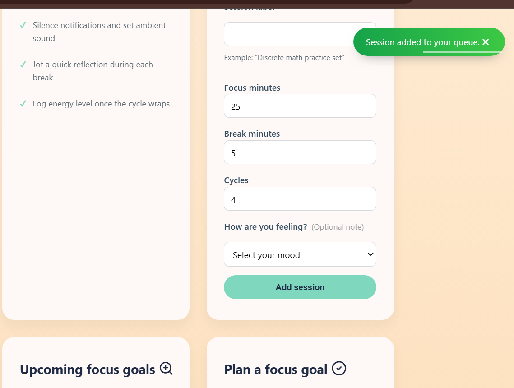
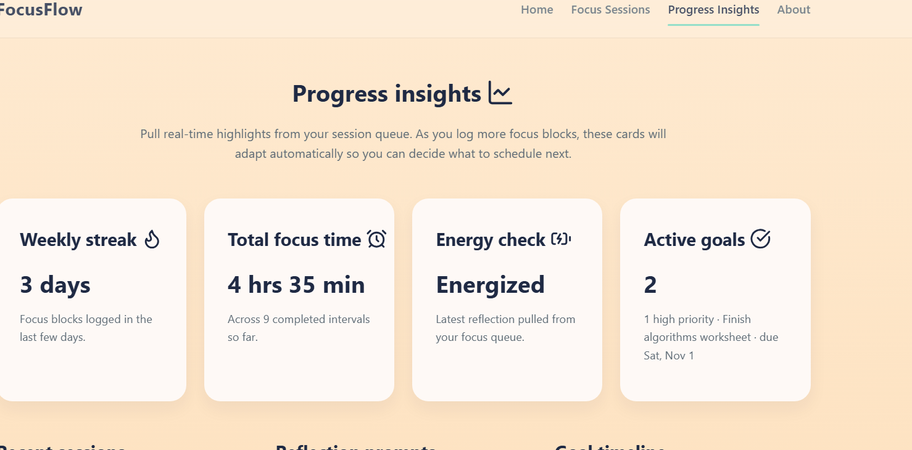

# FocusFlow Study Timer App

FocusFlow is our CS346 semester project for building a study timer web application with Node.js, Express, EJS, and PostgreSQL.

## Features

- 🚀 **Node.js 20** + **Express 4** - Modern JavaScript backend
- 🎨 **EJS** - Server-side templating
- 🗄️ **PostgreSQL** - Reliable relational database
- 🔒 **Security First** - Helmet, CSRF protection, secure sessions
- 📝 **Clean Code** - ESLint, Prettier, best practices
- 🎓 **Educational** - Well-documented, instructional code

## Quick Start

1. **Clone the repository**

   ```bash
   git clone https://github.com/UWO-CS346-Fall-25/cs346f25-study-timer-pomodoro-app.git
   cd cs346f25-study-timer-pomodoro-app
   ```

2. **Install dependencies**

   ```bash
   npm install
   ```

3. **Set up environment variables**

   ```bash
   cp .env.example .env
   # Edit .env with your database credentials
   ```

4. **Set up PostgreSQL database**

   ```bash
   # Create database (adjust credentials as needed)
   createdb your_database_name
   ```

5. **Run migrations**

   ```bash
   npm run migrate
   ```

6. **Seed database (optional)**

   ```bash
   npm run seed
   ```

7. **Start the application**

   ```bash
   npm run dev
   ```

8. **Open your browser**
   ```
   http://localhost:3000
   ```

## Current Pages (Deliverable 1)

The Week 7 HTML/CSS deliverable focuses on the static structure of the FocusFlow study timer. The Express app now serves four EJS pages with shared navigation and footer:

- Home (``) – High-level overview of FocusFlow with hero messaging, feature highlights, and workflow steps.
- Focus Sessions (`/focus`) – Static mock of the timer controls, preset selector, and session queue layout.
- Progress Insights (`/insights`) – Dashboard-style placeholders showing weekly metrics, recent sessions, and reflection prompts.
- About (`/about`) – Team introduction plus the goals for this deliverable.

All pages share the new FocusFlow color palette and component styles, including background colors and interactive button states defined in `src/public/css/style.css`. Content remains static by design; JavaScript logic and data integration will arrive later.

## Current Pages (Deliverable 2)

Week 8 focuses on the interactive Focus Sessions flow and basic server logic.

- **Ab (server & data)**
  - Hold session data in memory (seed JSON for defaults) and pass it to EJS.
  - Handle POST `/focus/sessions`, validate input, and set flash messages.
  - Return a JSON API (`/api/sessions`) that client JS can call.
  - Write the client logic to validate the form and refresh the queue live.
- **Dasha (client experience)**
  - Wire preset buttons and form validation on the Focus page.
  - Keep the current-interval hero, session queue, and summary in sync.
  - Show inline success/error states with keyboard-friendly controls.
  - Polish styling/animations so interactions feel smooth.

## Current Pages (Deliverable 3)

Week 9 focuses on front-end polish, form design, and usability improvements.

## What we already cover
- Focus session form already meets the 3+ input types + validation requirement (`src/views/focus.ejs`, `src/public/js/main.js`, `POST /focus/sessions`).
- Routes/controllers already capture submissions and return JSON (`src/controllers/indexController.js`).
- Base UI has gradients, active states, and responsive grids from Deliverable 2 (`src/public/css/style.css`).

## Split
**Ab**
- Keep `feature/week9-ui-enhancements` in sync with `main`
- Build the goal endpoints (`POST /focus/goals`, `/api/goals`) plus the supporting model `src/models/goalStore.js`; continue to expose any extra data modifications Dasha needs.
- Wire any additional template placeholders or partials needed for the UI polish (e.g., hero copy, modals) and keep MVC tidy.
- Refresh README once Dasha finishes visuals and drop the proof assets into `docs/` before the PR.

**Dasha**
- Does the front-end polish: integrate the selected UI improvements (animations, spacing, responsive adjustments) in `src/public/css/style.css` and `src/public/js/main.js`.
- Pull in Lucide icons and Toastify (or the final two choices) and apply them to the focus/insights pages.
- Capture the Week 9 screenshots or a short clip for the PR + README.

## New Improvements description and screenshots
- Added 3 input types in session queue form (input, number, and drop down menu)
- Integrated CSS background, header, and footer transitions and animations when quick presets buttons are clicked
- Updated button clicks by adding a transition to show when a button is pressed
- Added Toastify notifications to improve the notification visuals
- Added Lucide Icons to create a visually appealing website





## Project Structure

```
├── src/
│   ├── server.js           # Server entry point
│   ├── app.js              # Express app configuration
│   ├── routes/             # Route definitions
│   ├── controllers/        # Request handlers
│   ├── models/             # Database models
│   ├── views/              # EJS templates
│   └── public/             # Static files (CSS, JS, images)
├── db/
│   ├── migrations/         # Database migrations
│   ├── seeds/              # Database seeds
│   ├── migrate.js          # Migration runner
│   ├── seed.js             # Seed runner
│   └── reset.js            # Database reset script
├── docs/                   # Documentation
│   ├── README.md           # Documentation overview
│   ├── SETUP.md            # Setup guide
│   └── ARCHITECTURE.md     # Architecture details
├── .env.example            # Environment variables template
├── .eslintrc.json          # ESLint configuration
├── .prettierrc.json        # Prettier configuration
└── package.json            # Dependencies and scripts
```

## Available Scripts

- `npm start` - Start production server
- `npm run dev` - Start development server with auto-reload
- `npm run migrate` - Run database migrations
- `npm run seed` - Seed database with sample data
- `npm run reset` - Reset database (WARNING: deletes all data!)
- `npm run lint` - Check code for linting errors
- `npm run lint:fix` - Fix linting errors automatically
- `npm run format` - Format code with Prettier

## Security Features

- **Helmet**: Sets security-related HTTP headers
- **express-session**: Secure session management with httpOnly cookies
- **csurf**: Cross-Site Request Forgery (CSRF) protection
- **Parameterized SQL**: SQL injection prevention with prepared statements
- **Environment Variables**: Sensitive data kept out of source code

## Documentation

Comprehensive documentation is available in the `docs/` folder:

- [docs/README.md](docs/README.md) - Documentation overview
- [docs/SETUP.md](docs/SETUP.md) - Detailed setup instructions
- [docs/ARCHITECTURE.md](docs/ARCHITECTURE.md) - Architecture and design patterns

## Technology Stack

- **Runtime**: Node.js 20
- **Framework**: Express 4
- **Templating**: EJS
- **Database**: PostgreSQL (with pg driver)
- **Security**: Helmet, express-session, csurf
- **Development**: ESLint, Prettier, Nodemon

## Learning Resources

- [Express.js Documentation](https://expressjs.com/)
- [EJS Documentation](https://ejs.co/)
- [PostgreSQL Documentation](https://www.postgresql.org/docs/)
- [Node.js Documentation](https://nodejs.org/docs/)
- [OWASP Security Guide](https://owasp.org/)

## Contributing

This is a teaching template. Feel free to:

- Report issues
- Suggest improvements
- Submit pull requests
- Use it for your own projects

## License

ISC
